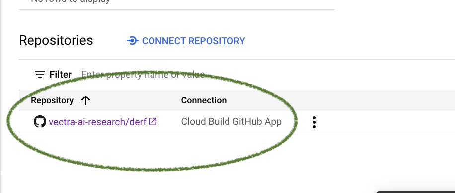

## Connecting Cloud Build with the DeRF Github Repo

The DeRF deployment creates a Continuous Deployment (CD) pipeline from the `DeRF` Github Repository.  Before deploying into a GCP Project for the first time, you will need to create the connection between your GCP Project and Github.

To connect a GitHub repository to a host connection, complete the following steps:

1. Connect to a repository on the [Google Cloud console](https://console.cloud.google.com/cloud-build/triggers;region=global/connect).
2. With the link above, the side panel called 'Connect Repository' will be shown on the right. Select the Github Cloud Build Github App.

3. On the next screen, connect to the `vectra-ai-research` github account and the `vectra-ai-research/derf` Repository.  Click `Connect` to create the connection.

4. After the connection is made, on the Cloud Build Repositories page on [Google Cloud console](https://console.cloud.google.com/cloud-build/repositories/1st-gen?) you will see the connection listed.  At anytime you can delete or disable the connection although this will prevent you from receiving updates to the `aws-proxy-app`.

## Approving Builds
With this connection between Cloud Build and Github, whenever there is an update to the `aws-proxy-app` a Build will be queued in your GCP Project.  
The Build requires your manual approval in order to run and deploy a new version to Cloud Run.