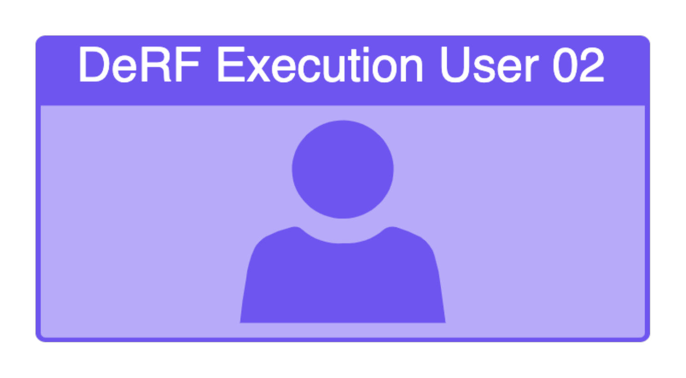

# DeRF Documentation Home
 
Welcome to the Home Page of the DeRF Documentation. Key features of this tool include:  

•	<b>User-Friendly Interface</b>: Since the DeRF is hosted in Google Cloud, End Users can invoke attacks through the cloud console UI without the need to install software or use the CLI.

•	<b>Accessibility for Non-Security Professionals</b>: The DeRF caters to a broad audience of End Users, including Engineering, Sales, Support Staff, or automated processes.

•	<b>Robust OpSec</b>: Long-Lived Credentials are not passed between operators, instead access to the DeRF and its attack techniques are controlled through GCP IAM Role-Based Access Control (RBAC)

•	<b>Extensibility at its Core</b>: Attack sequences are written in YAML, enabling easy configuration of new techniques.

•	<b>Turn-Key deployment</b>: Deploying (and destroying!) the DeRF is a fully automated process, completed in under 3 minutes.

## **High Level Architecture**  

The DeRF’s unique architecture is wholly deployed via terraform.  It consists of resources spread across AWS and GCP.

## DeRF Attack Architecture for AWS  

## **DeRF User Personas**
See the [User Guide](./user-guide/execution-user-permissions.md) for more detailed descriptions of the permissions assigned to the DeRF Execution and Default Users.

{ align=left width=300 } 

^^The DeRF Deployment User^^ deploys the DeRF terraform module across AWS and GCP. Permissions required for the DeRF Deployment User are documented [here](./Deployment/deployment-permissions.md)    

  

{ align=left width=300 }   

^^The DeRF Execution User 01^^ is one of two built in an AWS IAM Users which AS attack techniques can run as. Permissions are assigned to the `derf-execution-users` AWS IAM Group and documented within each attack module.  
  

{ align=left width=300 }  

^^The DeRF Execution User 02^^ is one of two built in an AWS IAM Users which AWS attack techniques can run as. Permissions are assigned to the `derf-execution-users` AWS IAM Group and documented within each attack module.  
  

{ align=left width=300 }  

^^The DeRF Default User^^ is an AWS IAM User used by attack techniques to revert state changing actions by the AWS attack modules.  If AWS attack techniques are run with the user parameter left blank, the attack with default to run as this user.   
  

{ align=left width=300 }   

In order to perform an attack as an arbitrary ^^AWS Role^^, AWS IAM Temporary Session Credentials generated from IAM Roles can be passed directly to the `aws-proxy-app` as Post Body Parameters additionally with the `TEMPCREDSPASSED = yes` Post Body parameter.
  

{ align=left width=300 }  

^^The DeRF Service Account 01^^ is one of two built in Service Accounts which GCP attack techniques can run as. Roles are assigned to these two DeRF Execution Service accounts in the targeted Project as part of tool deployment.   
          
   

{ align=left width=300 }  

^^The DeRF Service Account 02^^ is one of two built in Service Accounts which GCP attack techniques can run as.Roles are assigned to these two DeRF Execution Service accounts in the targeted Project as part of tool deployment.   
          
   