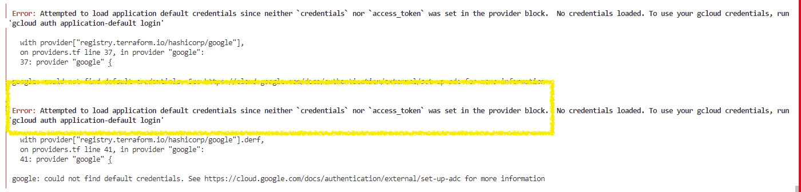

## Troubleshooting DeRF Deployment

1. #### CLI Error Message: "You are not authenticated against AWS"
> "*You are not authenticated against AWS, or you have not set your region.*"  
      - You must be authenticated to AWS (and GCP) before deploying the DeRF via Terraform.  
```bash
aws sso login --profile PROFILE_NAME
```

2. #### CLI Error Message: "Error: error configuring S3 Backend"
>  Error: error configuring S3 Backend: no valid credential sources for S3 Backend found.
│
│ Please see https://www.terraform.io/docs/language/settings/backends/s3.html
│ for more information about providing credentials.
│
│ Error: SSOProviderInvalidToken: the SSO session has expired or is invalid

    

     - You must be authenticated to AWS (and GCP) before deploying the DeRF via Terraform.   
```bash
aws sso login --profile PROFILE-NAME
```

     - You must set the AWS_PROFILE to the AWS profile of the target infrastructure  
```bash
export AWS_PROFILE=PROFILE
```

3. #### CLI Error Message: "Error: Failed to read variables file"
> "*│ Error: Failed to read variables file*"

    - When running `terraform apply -var-file=derf.tfvars` the program must be to find the specified variables file. Ensure you are in the `./env-prod` directory when applying the terraform. Ensure the `.tfvars` file you specified is in your path.


4. #### CLI Error Message: "Error: Attempted to load application default credentials"

> "Error: Attempted to load application default credentials since neither credentials nor access_token was set in the provider block. No credentials loaded. To use your gcloud credentials, run 'gcloud auth application-default login' "




    - When using the Google Cloud provider in terraform, be sure to generate 'ADC' credentials' with the following command:

  `gcloud auth application-default login --project=PROJECT_ID`


## Troubleshooting Attack Execution


1. Error Message on the Google Cloud Console:
> KeyError: key not found: user


   - All workflows need to be executed with either User01 or User02. Do so by sending JSON input during workflow execution.  
    - Input Required:
        - {"user":"user01"} OR {"user":"user02"}
