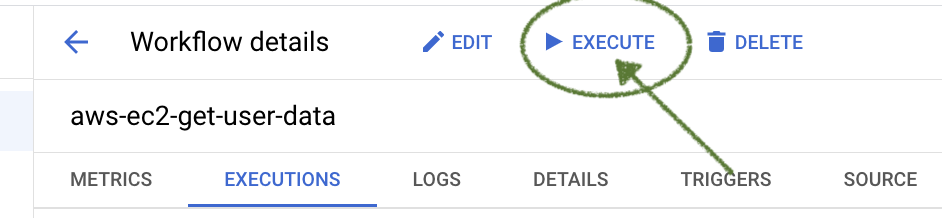

Attacks execution is performed by invoking a Google Cloud Workflow. Workflows can be invoked either on the Google Cloud Console or programmatically with the `gcloud cli`

## Attack Execution -  on the Console
1. Log into the [Google Cloud Console](https://console.cloud.google.com/workflows/) and navigate to the workflows page.
2. Click on the name of the workflow that matches the attach you want to execute.

1. Click on the execute button.

1. Refer to the code panel on the right-hand side and select which user to run the attack as by copying one of the possible inputs.

1. Paste selected json in the input panel on the left-hand side.

1. Finally, select the `Execute` button at the bottom of the screen.

The results of the attack will be displayed on the right-hand side of the screen.

